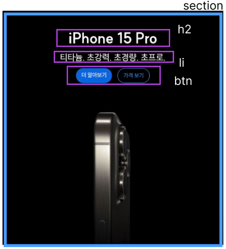
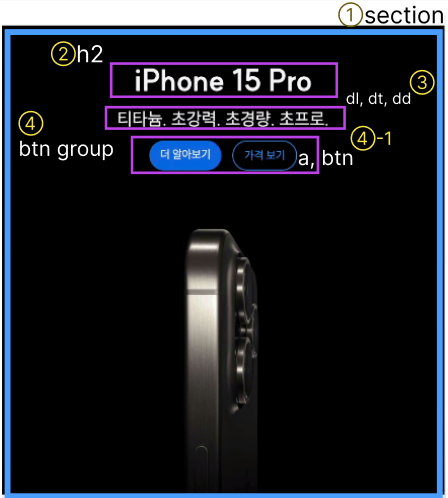

# Apple Page (2024/05/18)

---

## 마크업⚙

해당 이미지는 내가 처음 마크업을 설계하면서 간단하게 영역을 나눈 것이다. 반복되고 재사용되는 개별 section을 하나의 컴포넌트로 만들어 사용하기 위해 한 section만 설계를 하고 가져다가 쓰는 식으로 구현했다.
처음 마크업 한 걸 보면 section 안에 h2, 그리고 리스트와 버튼이 있다.

그리고 위 이미지는 내가 최종적으로 선택한 마크업 이미지이다. 또한 해당 이미지상에서는 표기가 안되어 있지만 p태그를 사용하여 '출시일 추후 공개' 요소를 넣었다.

첫번째로 마크업에서 고민한 부분은 제품명 하단에 있는 간단한 제품 설명 문구 부분이다. 처음엔 단순한 문구니까 p태그를 써야하나, 했으나 너무 1차원적인 접근이었고 시멘틱한 마크업에 알맞지 않았다. 그러다가 li와 dl태그를 고민하게 되었다.

나는 우선 저 부분을 제품의 설명이라고 판단했다. 상세 설명처럼 아주 디테일하진 않고 어떻게 보면 홍보 문구로도 보이지만, 제품의 특성이 드러나는 영역이라 생각하여 제품의 설명임을 명시해주면 좋겠다고 생각했다.

그렇게 첫번째로 ul과 li 태그를 고려했다. 그러나 제품명과 설명이 좀 더 유기적으로 묶여있으면 좋겠다고 판단했다. 그래서 dl을 사용해 dt로는 제품명을 넣고 dd에 넣고자 하는 문구를 넣었다.

그리고 하단은 a태그와 button을 사용하여 특정 링크로 이동할 수 있는 버튼을 구현하였다.

또 중간에 '출시일 추후 공개' 라는 영역이 있다. 어떤 section에는 있고, 또 어떤 section에는 없다. 아무래도 적절한 태그가 생각나지 않아, p태그를 넣었는데 출시일과 관련한 영역임을 명시해 주고 싶어서 aria-label을 이용해 출시일을 넣었다. 그러다 보니 해당 영역이 없는 다른 section에선 출시일과 관련한 스크린 리더 요소가 없을텐데 어떻게 하면 좋지, 하는 생각이 들었다. 그래서 모든 section에 해당 영역을 추가하고 화면엔 보이지 않게 처리한 후, '출시일 추후 공개' 영역이 없는 section은 임의로 제품 출시가 되었다고 가정하여 p태그 내용에 '출시됨' 을 적어 넣었다.

사실 이렇게 하면서도 스스로가 적절한 설계를 한건지 판단이 서질 않아서... 통일성을 부여하는 것이 좋은지, 아니면 그냥 보이는 요소만 넣는게 좋은지 고민스러웠다.

---

## 스타일링🎨
CSS 부분에서는 section과 button 그룹에 display: flex를 사용하였다. 이를 통해 section은 세로 배열을 하고 모든 요소를 가운데로 정렬하였다. 그리고 각 요소 사이에 gap을 추가하여 간격을 넣었다. 또한 버튼은 가로 정렬을 한 후 gap을 이용해서 필요한 간격을 넣었다.

이미지는 background-image 속성을 사용해 배경 이미지로 설정하고 background-position을 사용해 항상 이미지가 가운데에 배치되도록 했다.

그리고 이미지 최적화를 위해 image-set함수를 사용해 2배율 이미지를 추가하였다.

버튼 디자인을 보니 검정 버튼과 파란 버튼이 있어서 각각 클래스를 만들어 일관된 디자인을 한 후 해당하는 요소에 클래스를 부여하였다. 좀 더 동적인 요소를 넣기 위해 transition을 사용해 버튼에 마우스가 hover되면 서서히 색상이 바뀌도록 하였다.

또한 반응형 페이지를 구현하기 위해 미디어 쿼리를 사용하였다. 페이지 너비 1024px을 기준으로 하여 글자크기와 배경 이미지를 바꿨다.

이렇게 만든 컴포넌트 html 파일을 components 폴더에 넣어서 필요한만큼 복사 및 붙여넣기를 하여 사용하였다.

그래서 apple.css 파일에는 전체 레이아웃에 관련한 디자인을 하였다. section을 감싸고 있는 main 요소에 grid 속성을 부여하여 기본적으로 모든 section이 세로로 한 줄씩 배열되게 하였다. 그러다 페이지 너비가 1024px이 되면 두 줄이 되는데, 순서상 위에서 세개의 section은 grid-column을 사용하여 가로로 한줄을 통째로 차지하게 하였다. 그리고 전반적으로 base spacing을 넣었다.
